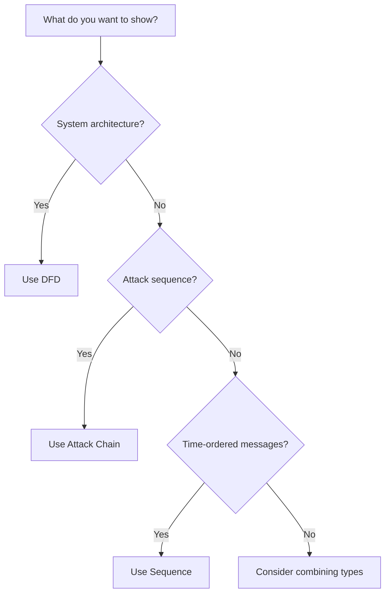

# Diagram Types

Threat Model Spec supports three diagram types, each suited for different threat modeling scenarios.

## Overview

| Type | Use Case | Key Fields |
|------|----------|------------|
| `dfd` | Data Flow Diagrams | elements, boundaries, flows |
| `attack-chain` | Attack sequences | elements, attacks, targets |
| `sequence` | Time-ordered messages | actors, messages, phases |

## Data Flow Diagram (DFD)

Data Flow Diagrams visualize how data moves through a system, highlighting trust boundaries and potential attack surfaces.

### When to Use

- System architecture documentation
- Identifying trust boundaries
- Analyzing data flows between components
- Security review of new features

### Structure

```json
{
  "type": "dfd",
  "title": "System Architecture",
  "elements": [
    {"id": "user", "label": "User", "type": "external-entity"},
    {"id": "web", "label": "Web Server", "type": "process"},
    {"id": "db", "label": "Database", "type": "datastore"}
  ],
  "boundaries": [
    {
      "id": "dmz",
      "label": "DMZ",
      "type": "network",
      "elements": ["web"]
    }
  ],
  "flows": [
    {"from": "user", "to": "web", "label": "HTTPS Request"},
    {"from": "web", "to": "db", "label": "SQL Query"}
  ]
}
```

### Key Fields

| Field | Description |
|-------|-------------|
| `elements` | Processes, data stores, and external entities |
| `boundaries` | Trust boundaries containing elements |
| `flows` | Data flows between elements |

## Attack Chain

Attack Chain diagrams show the sequence of steps an attacker takes to compromise a system, mapping to frameworks like MITRE ATT&CK.

### When to Use

- Documenting known attack vectors
- Incident response analysis
- Red team planning
- Security training

### Structure

```json
{
  "type": "attack-chain",
  "title": "Credential Theft Attack",
  "elements": [
    {"id": "attacker", "label": "Threat Actor", "type": "external-entity"},
    {"id": "phishing", "label": "Phishing Email", "type": "process"},
    {"id": "creds", "label": "Credentials", "type": "datastore"}
  ],
  "attacks": [
    {
      "step": 1,
      "from": "attacker",
      "to": "phishing",
      "label": "Send phishing email",
      "mitreTechnique": "T1566"
    },
    {
      "step": 2,
      "from": "phishing",
      "to": "creds",
      "label": "Harvest credentials",
      "mitreTechnique": "T1110"
    }
  ],
  "targets": [
    {
      "elementId": "creds",
      "impact": "Credential compromise leading to unauthorized access"
    }
  ]
}
```

### Key Fields

| Field | Description |
|-------|-------------|
| `elements` | Components involved in the attack |
| `attacks` | Ordered attack steps with techniques |
| `targets` | Final targets and impact |

## Sequence Diagram

Sequence diagrams show time-ordered interactions between actors, useful for visualizing attack timelines and protocol flows.

### When to Use

- Protocol analysis
- Attack timeline documentation
- Authentication flow review
- API security analysis

### Structure

```json
{
  "type": "sequence",
  "title": "Authentication Bypass",
  "actors": [
    {"id": "attacker", "label": "Attacker", "malicious": true},
    {"id": "server", "label": "Server"},
    {"id": "db", "label": "Database"}
  ],
  "messages": [
    {
      "from": "attacker",
      "to": "server",
      "label": "Malformed auth request",
      "type": "attack"
    },
    {
      "from": "server",
      "to": "db",
      "label": "Bypass query"
    },
    {
      "from": "db",
      "to": "attacker",
      "label": "Sensitive data",
      "type": "exfil"
    }
  ],
  "phases": [
    {"name": "Initial Access", "startMessage": 0},
    {"name": "Data Exfiltration", "startMessage": 2}
  ]
}
```

### Key Fields

| Field | Description |
|-------|-------------|
| `actors` | Participants in the sequence |
| `messages` | Ordered messages between actors |
| `phases` | Optional grouping of attack phases |

## Choosing a Diagram Type



## Combining Diagrams

For comprehensive threat models, use multiple diagram types:

1. **DFD** — Document system architecture and trust boundaries
2. **Attack Chain** — Map specific attack vectors with MITRE ATT&CK
3. **Sequence** — Detail the timeline of critical attacks
