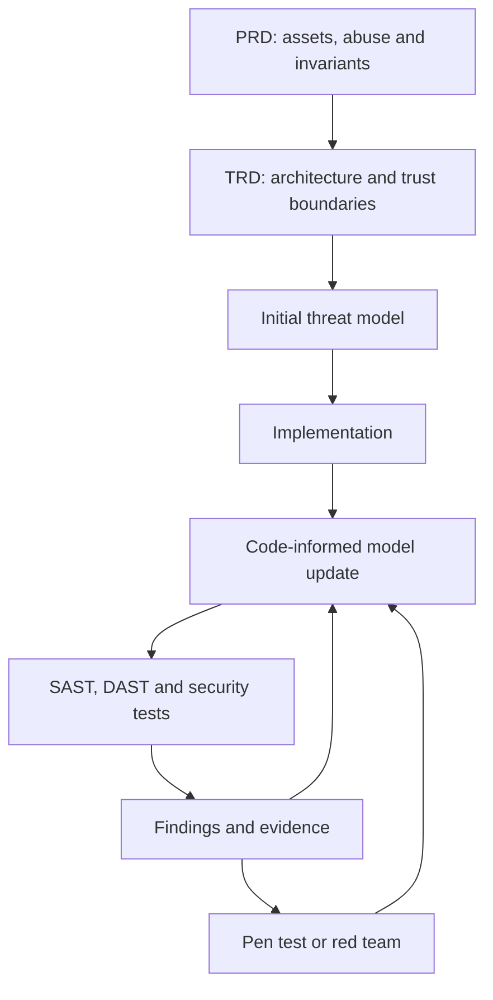
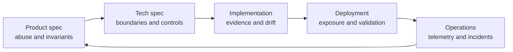
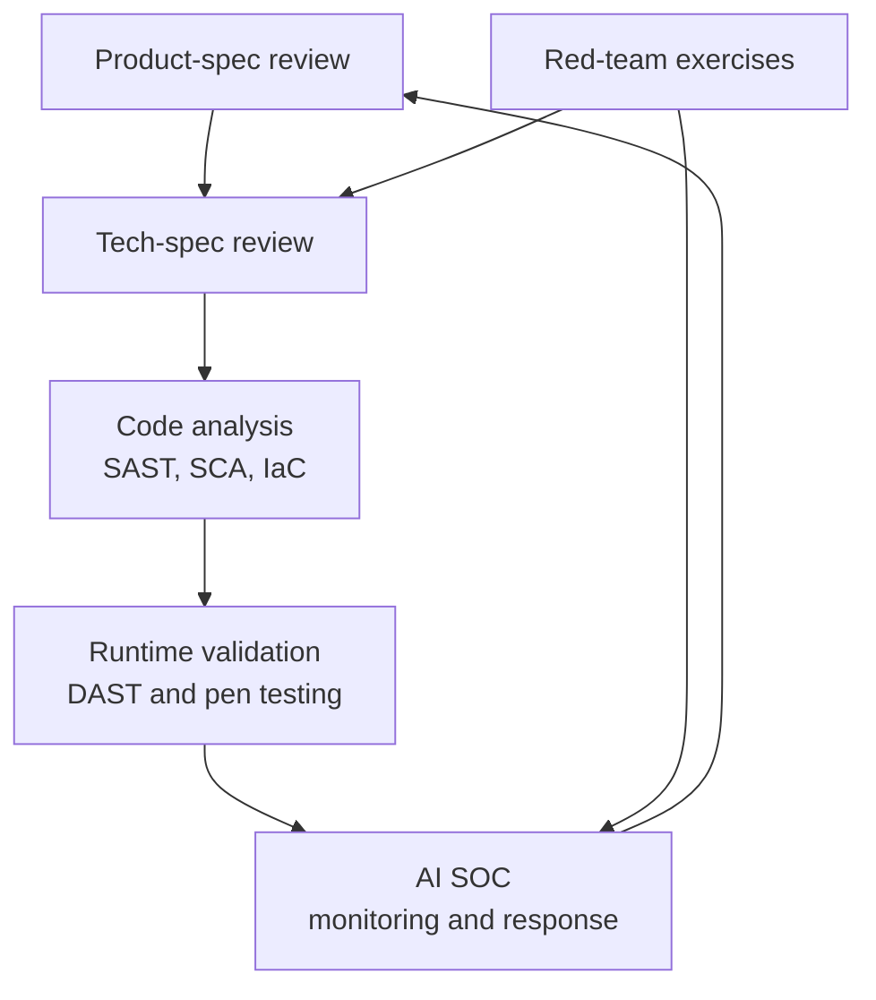
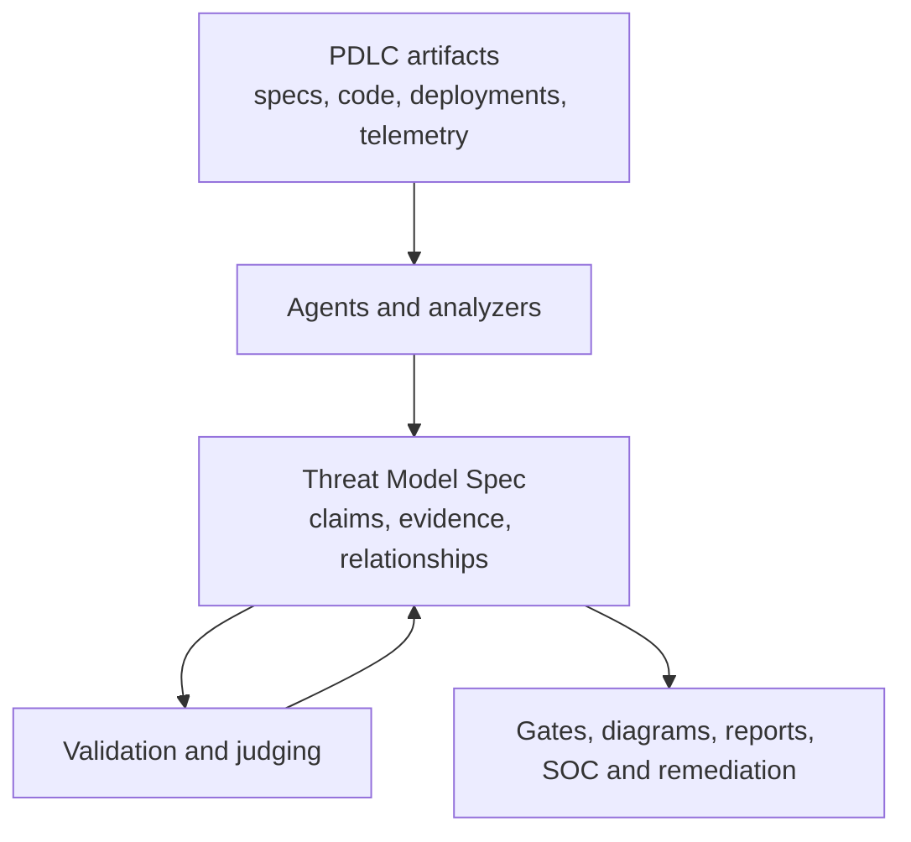

> Threat Modeling - what are general approaches for threat modeling?

Common threat-modeling approaches include:

1. **Asset-centric**
   Start with what must be protected—data, credentials, services, reputation—then identify threats to confidentiality, integrity, and availability.

2. **Architecture/system-centric**
   Diagram components, trust boundaries, data flows, identities, and dependencies. Analyze threats wherever data crosses a boundary. Data Flow Diagrams are commonly used.

3. **Attacker-centric**
   Model likely adversaries, their goals, capabilities, access, and attack paths. Useful methods include attack trees, abuse cases, and kill-chain analysis.

4. **Risk-centric**
   Identify threats, then prioritize them by likelihood and impact. Frameworks such as DREAD, risk matrices, or quantitative loss models like FAIR can help.

5. **Control-centric**
   Begin with a security standard or control catalog—such as NIST, ISO 27001, CIS Controls, or OWASP ASVS—and identify gaps. Good for compliance, though it can miss novel design-specific threats.

Common frameworks include:

* **STRIDE:** Spoofing, Tampering, Repudiation, Information disclosure, Denial of service, Elevation of privilege.
* **PASTA:** A seven-stage, risk-focused process connecting business impact to technical attack analysis.
* **LINDDUN:** Privacy-focused modeling covering threats such as linkability, identifiability, and detectability.
* **Attack trees:** Break an attacker’s objective into alternative and dependent paths.
* **MITRE ATT&CK:** Map realistic adversary techniques, especially for enterprise systems and operational defenses.
* **OWASP Threat Modeling:** A practical application-security approach centered on system decomposition, threats, mitigations, and validation.

A practical lightweight process is:

1. Define scope, assumptions, assets, and security objectives.
2. Diagram the system and mark trust boundaries and data flows.
3. Identify threats using STRIDE, abuse cases, and attacker goals.
4. Estimate risk and prioritize scenarios.
5. Select mitigations—preventive, detective, and recovery controls.
6. Record decisions, owners, and accepted residual risk.
7. Validate through testing and revisit after meaningful design changes.

The most effective programs combine approaches: architecture-centric analysis for coverage, attacker-centric analysis for realism, and risk-centric prioritization for action. Threat modeling works best early in design and continues as a living engineering activity rather than a one-time checklist.

===

> How much of of the common frameworks can be turned into JSON IR that we then have specialized code / systems analysis agents fill out and then have an LLM-as-a-Judge grade for vulnerabilities?

A large portion—roughly **75–90% of the mechanics**—can be represented as JSON IR and processed by specialized agents. The harder part is not representing the framework; it is ensuring the input model is complete and distinguishing real vulnerabilities from plausible-sounding ones.

The best design is a shared canonical threat-model IR, with STRIDE, OWASP, ATT&CK, LINDDUN, attack trees, and risk models implemented as analysis passes over it.

## What maps well to JSON

| Threat-model element           |       JSON suitability | Notes                                                               |
| ------------------------------ | ---------------------: | ------------------------------------------------------------------- |
| Scope and assumptions          |              Excellent | Explicit inclusions, exclusions, environments, attacker assumptions |
| Components and services        |              Excellent | Types, technologies, privileges, deployment properties              |
| Data flows                     |              Excellent | Sources, destinations, protocols, authentication, data classes      |
| Trust boundaries               |              Excellent | Boundary crossings and enforcement points                           |
| Assets and security objectives |              Excellent | Confidentiality, integrity, availability, privacy requirements      |
| Identities and permissions     |              Excellent | Human and machine principals, roles, grants, escalation paths       |
| STRIDE analysis                |              Excellent | Rules can generate candidate threats per element and flow           |
| LINDDUN analysis               |              Excellent | Works when identity and data-linkability properties are modeled     |
| Attack trees and abuse cases   |              Excellent | Naturally represented as graphs with AND/OR prerequisites           |
| ATT&CK mappings                |                   Good | Useful as supporting evidence, but not proof of a vulnerability     |
| Controls and mitigations       |              Excellent | Control state, coverage, evidence, owner, verification method       |
| Risk scoring                   |              Excellent | Deterministic formulas and structured uncertainty                   |
| Validation and test plans      |              Excellent | Maps threats to tests, evidence, expected results, and findings     |
| Novel threat discovery         |               Moderate | Agents can hypothesize, but completeness cannot be guaranteed       |
| Business impact and likelihood |               Moderate | Requires organizational context and calibrated judgment             |
| Hidden implementation flaws    | Poor from design alone | Requires code, configuration, runtime, and test evidence            |

## Use a canonical IR, not a “STRIDE JSON schema”

Frameworks are different views over much of


A large portion—roughly **70–90% of the workflow structure**—can be represented as JSON IR. The harder part is not representing the frameworks; it is obtaining reliable evidence and judging whether the resulting threat model is complete and correct.

A good design would treat JSON as a shared, versioned threat-model IR rather than encoding each framework independently.

## What translates well

| Threat-model element                    |  JSON suitability | Notes                                          |
| --------------------------------------- | ----------------: | ---------------------------------------------- |
| Scope, assumptions, objectives          |              High | Structured assertions with provenance          |
| Components and data stores              |              High | Stable entity types and identifiers            |
| Data flows and trust boundaries         |              High | Naturally forms a typed graph                  |
| Assets and classifications              |              High | Include sensitivity and business impact        |
| Identities, roles, privileges           |              High | Important for authorization analysis           |
| Entry points and attack surfaces        |              High | Derived from architecture and code             |
| STRIDE classifications                  |         Very high | Simple taxonomy over entities and flows        |
| ATT&CK technique mappings               |              High | References and confidence scores               |
| Attack trees and attack paths           |              High | AND/OR dependency graphs                       |
| Abuse and misuse cases                  |              High | Preconditions, actions, outcomes               |
| Mitigations and controls                |              High | Map controls to specific threat claims         |
| Risk scores                             | High structurally | Inputs fit JSON; estimates remain subjective   |
| Validation and test plans               |              High | Explicit testable assertions                   |
| Privacy models such as LINDDUN          |              High | Needs privacy-specific entities and properties |
| “What did we miss?”                     |               Low | This is an inference and coverage problem      |
| Business impact and attacker creativity |            Medium | Can be recorded, but not mechanically derived  |

The main thing JSON cannot guarantee is **semantic completeness**. A perfectly valid document may omit the most important trust boundary, use an inaccurate assumption, or describe a mitigation that does not actually block the attack.

## Recommended IR structure

Separate facts, derived findings, judgments, and evidence:

```json
{
  "model_version": "1.0",
  "system": {
    "name": "payments-api",
    "scope": [],
    "security_objectives": [],
    "assumptions": []
  },
  "architecture": {
    "components": [],
    "data_stores": [],
    "actors": [],
    "data_flows": [],
    "trust_boundaries": [],
    "deployment_zones": []
  },
  "security_context": {
    "assets": [],
    "identities": [],
    "privileges": [],
    "entry_points": [],
    "dependencies": []
  },
  "threats": [],
  "attack_paths": [],
  "mitigations": [],
  "validation_cases": [],
  "risk_decisions": [],
  "coverage": {},
  "provenance": []
}
```

A threat should be a falsifiable claim rather than merely a label:

```json
{
  "id": "THR-017",
  "title": "Forged webhook changes payment state",
  "framework_mappings": [
    {"framework": "STRIDE", "id": "S"},
    {"framework": "MITRE_ATTACK", "id": "T1190"}
  ],
  "target_refs": ["component:webhook-handler"],
  "asset_refs": ["asset:payment-state"],
  "preconditions": [
    "The endpoint is reachable externally",
    "Signature validation can be bypassed or is absent"
  ],
  "attack_steps": [
    "Send a forged payment-completed event",
    "Handler accepts the event",
    "Order state changes without a valid payment"
  ],
  "impact": {
    "integrity": "high",
    "financial": "high"
  },
  "evidence_refs": [
    "code:src/webhooks/payment.ts#L41-L72"
  ],
  "confidence": 0.86,
  "status": "candidate",
  "generated_by": "authorization-analysis-agent"
}
```

Every nontrivial claim should have:

* Stable references to affected entities.
* Preconditions and attack steps.
* Impacted security properties and assets.
* Source evidence.
* Confidence and uncertainty.
* A distinction between observed fact and inference.
* Mitigation and validation links.

## Multi-agent decomposition

Specialized agents can fill different IR projections:

1. **Architecture agent**
   Builds components, flows, boundaries, identities, and deployment zones.

2. **Code-evidence agent**
   Extracts endpoints, parsers, authentication checks, authorization decisions, secrets handling, and dangerous sinks.

3. **Data/security agent**
   Identifies assets, classifications, transformations, storage, retention, and encryption.

4. **STRIDE agent**
   Applies threat classes systematically to components, flows, stores, and boundaries.

5. **Authorization agent**
   Models principals, objects, actions, policies, tenant boundaries, and privilege-escalation paths.

6. **Attack-path agent**
   Chains local findings into feasible end-to-end attacks.

7. **Control agent**
   Links threats to preventive, detective, and recovery controls.

8. **Validation agent**
   Produces tests, telemetry requirements, and negative test cases.

9. **Adversarial critic**
   Searches specifically for missing components, unstated assumptions, invalid mitigations, and contradictions.

These agents should not all rewrite one shared blob. Each should emit claims or patches, followed by deterministic validation and entity resolution.

## What the judge should grade

Avoid one opaque score. Grade independent dimensions:

```json
{
  "finding_id": "THR-017",
  "grades": {
    "evidence_support": 4,
    "technical_correctness": 4,
    "attack_feasibility": 3,
    "impact_reasoning": 4,
    "novelty": 2,
    "mitigation_effectiveness": 3,
    "validation_quality": 4
  },
  "fatal_errors": [],
  "missing_evidence": [],
  "verdict": "accept_with_revision"
}
```

Useful judge dimensions include:

* **Grounding:** Does cited code or architecture support the claim?
* **Reachability:** Can attacker-controlled input reach the vulnerable operation?
* **Precondition realism:** Are required access and capabilities plausible?
* **Security consequence:** Is there an actual violated property?
* **Attack-path completeness:** Are intermediate steps accounted for?
* **Mitigation validity:** Does the control break the stated attack?
* **Duplication:** Is this materially different from existing findings?
* **Specificity:** Is it actionable and testable?
* **Coverage:** Were all relevant entity/framework combinations considered?
* **Uncertainty calibration:** Does confidence reflect evidence quality?

## Where LLM-as-a-Judge needs support

An LLM judge alone is vulnerable to plausible prose, shared blind spots, anchoring, and false confidence. A stronger pipeline combines:

* JSON Schema and referential-integrity validation.
* Static analysis, call graphs, IaC inspection, and policy engines.
* Deterministic coverage checks.
* Evidence retrieval independent of the proposing agent.
* Multiple judges or adversarial proposer/critic roles.
* Hidden seeded vulnerabilities for calibration.
* Human review for high-risk or low-evidence findings.

The judge should be allowed to return **“insufficient evidence”**, not be forced to decide whether every finding is real.

## Frameworks as views over one IR

Do not make STRIDE, ATT&CK, OWASP, PASTA, and LINDDUN separate source-of-truth formats. Represent the underlying system once and implement framework-specific projections:

* **STRIDE:** classification and coverage view.
* **ATT&CK:** adversary-technique and operational-detection view.
* **OWASP:** application decomposition, threat, mitigation, and verification view.
* **PASTA:** business-impact and attack-simulation workflow view.
* **LINDDUN:** privacy-property view.
* **Attack trees:** graph traversal over goals, preconditions, and steps.

The best division of labor is: **JSON IR for memory and interoperability, deterministic tools for invariants, specialized agents for analysis, LLM judges for critique and prioritization, and humans for consequential risk acceptance.**

===

> Does Threat Modeling happen before there is code written? For example do we do threat modeling on a design spec such as a PRD/TRD? After there is code, do we do Threat Modeling on the code, or at that point are we doing SAST/DAST/Red Teaming?

Yes—threat modeling should begin before code exists, commonly against a PRD, TRD, architecture diagram, API contract, or design proposal. It should then be updated using evidence from the implementation.

The activities are complementary, not mutually exclusive:

| Stage                | Primary question                                                                            | Typical techniques                                                                         |
| -------------------- | ------------------------------------------------------------------------------------------- | ------------------------------------------------------------------------------------------ |
| PRD                  | What could be abused, and what business harm could result?                                  | Abuse cases, assets, actors, security/privacy requirements                                 |
| TRD/design           | Where can attacks cross boundaries or violate security properties?                          | Data-flow diagrams, STRIDE, attack trees, trust-boundary analysis                          |
| Implementation       | Did the code preserve the model’s assumptions and controls? What new attack paths appeared? | Code-informed threat modeling, manual security review, SAST, SCA, secrets and IaC scanning |
| Running system       | Is it exploitable under realistic deployment conditions?                                    | DAST, API testing, configuration review, penetration testing                               |
| Adversarial exercise | Can an attacker achieve a meaningful objective across the full environment?                 | Red teaming                                                                                |
| Operations/change    | Did a new feature, dependency, incident, or architecture change alter risk?                 | Incremental threat-model updates and control validation                                    |

## Before code: model the intended system

### PRD-level threat modeling

At the product level, focus on:

* Valuable assets and sensitive actions.
* Users, administrators, partners, and attackers.
* Abuse and fraud scenarios.
* Privacy concerns.
* Regulatory and business-impact requirements.
* Security invariants.

Examples:

* “A merchant must never access another merchant’s customers.”
* “No single support employee may change both payout ownership and destination.”
* “Deleting an account must remove or irreversibly anonymize personal data within the stated retention period.”

This work often changes product requirements before architectural commitments become expensive.

### TRD-level threat modeling

Once the design exists, add:

* Components and data stores.
* APIs and data flows.
* Trust boundaries and deployment zones.
* Authentication and authorization decisions.
* Key and secret management.
* External dependencies.
* Failure modes and recovery controls.

At this point, STRIDE, attack trees, and data-flow analysis are especially useful. The outputs should include explicit threats, required mitigations, validation criteria, owners, and accepted risks.

## After code: keep threat modeling, then test its claims

Threat modeling after implementation is still threat modeling when the goal is to reason about:

* Whether the implementation matches the modeled architecture.
* Undocumented entry points and data flows.
* Actual authorization enforcement.
* New attack paths created by implementation choices.
* Whether assumed mitigations really exist.
* Whether dependencies or deployment configuration change the model.
* How multiple individually safe components compose into an unsafe system.

A code-informed threat model might discover that the design says every tenant lookup is scoped by `tenant_id`, but one background-job path retrieves records using only their object ID.

That same issue can then be sought through SAST, tested dynamically, and exercised as part of a larger attack path. The categories overlap because they answer different questions.

## How the methods differ

* **Threat modeling:** What could go wrong, where, why, and with what consequence?
* **SAST:** Does source or compiled code contain recognizable vulnerability patterns or unsafe flows?
* **DAST:** Can a running system be made to exhibit vulnerable behavior through its exposed interfaces?
* **Penetration testing:** Can a tester find and exploit weaknesses within a defined scope?
* **Red teaming:** Can an adversary achieve an operational objective, often across people, processes, identity, endpoints, and infrastructure?

Threat modeling gives the other activities hypotheses and priorities. Testing supplies evidence that validates or invalidates the threat model.



## Practical lifecycle

For each meaningful feature:

1. Create a lightweight PRD threat model.
2. Expand it during technical design.
3. Convert mitigations into engineering requirements and tests.
4. Compare the implementation with the modeled design.
5. Run automated and manual security testing.
6. Feed discoveries back into the model.
7. Revisit it when trust boundaries, permissions, data classifications, or dependencies change.

So the handoff is not “threat modeling ends and SAST begins.” It is:

> **Design-time threat modeling predicts failure modes; implementation analysis and adversarial testing verify, refine, and challenge those predictions.**

===

> If we think about an AI PDLC: there's Product Specs > Tech Specs > Implementation > Deployment ... which is similar to original Product Requiremetns > Engineering Design > Implementation > Deployment, but much faster, we can have Threat Modeling happen as part of each step?

Yes. In an AI-accelerated PDLC, threat modeling should be a **continuous, stage-specific analysis**, with one evolving threat model carried from product intent through production evidence.

The key is that each stage answers different security questions and adds resolution to the same model.

| PDLC stage     | Threat-modeling focus                              | Inputs                                                        | Outputs / gates                                                            |
| -------------- | -------------------------------------------------- | ------------------------------------------------------------- | -------------------------------------------------------------------------- |
| Product spec   | Abuse, business harm, privacy, unsafe capabilities | Product behavior, users, data, AI capabilities                | Assets, abuse cases, security invariants, prohibited outcomes              |
| Tech spec      | Architecture and attack paths                      | APIs, models, data flows, identity design, dependencies       | Trust boundaries, STRIDE threats, required controls, validation plan       |
| Implementation | Design-to-code drift and concrete vulnerabilities  | Code, prompts, agent tools, policies, dependencies, IaC       | Evidence-backed findings, implemented-control checks, security tests       |
| Deployment     | Environment-specific exposure and exploitability   | Runtime topology, IAM, network policy, configuration, secrets | Deployment threats, DAST results, configuration findings, release decision |
| Operation      | Emerging behavior and control effectiveness        | Telemetry, incidents, model changes, user abuse               | Updated risks, detections, mitigations, regression cases                   |

### Product-spec stage

Model what can go wrong at the behavioral level:

* Who can use or abuse the product?
* What data and actions are sensitive?
* What must always or never happen?
* What AI-specific failures matter: prompt injection, data leakage, harmful autonomy, misleading output, or unauthorized tool use?
* What are the acceptable human-approval boundaries?

Example invariants:

```text
The assistant must not send an external message without explicit user approval.
One tenant’s retrieved documents must never influence another tenant’s output.
Model-generated identifiers must never be treated as authorization evidence.
```

These become persistent threat-model objects and later executable tests.

### Tech-spec stage

Turn product risks into system-level threats:

* Map components, model calls, retrieval systems, tools, stores, and external services.
* Mark trust boundaries and untrusted content.
* Model authentication, authorization, tenancy, and delegation.
* Analyze indirect prompt injection and confused-deputy paths.
* Define least-privilege tool permissions, data handling, isolation, and approval controls.
* Attach every mitigation to a validation method.

A release gate here might require that every high-impact action have an authorization control and every untrusted-to-model flow have an injection strategy.

### Implementation stage

Enrich the design model with code evidence:

* Verify that required controls exist.
* Detect divergence between the technical specification and code.
* Trace user/model-controlled data to sensitive sinks.
* Inspect prompt construction, tool schemas, output parsing, and authorization enforcement.
* Run SAST, dependency, secrets, IaC, and policy scans.
* Generate adversarial unit, integration, and agent-evaluation cases.

SAST and related tools provide evidence to the threat model; they do not replace it.

### Deployment stage

Bind the model to the actual environment:

* Verify IAM, network exposure, secrets, logging, and tenant isolation.
* Check that model and tool permissions match the intended design.
* Run DAST and abuse-case tests against the deployed application.
* Confirm rate limits, kill switches, approval flows, and rollback behavior.
* Record accepted residual risks and release ownership.

A threat may be controlled in code but reintroduced through deployment—for example, a private administrative endpoint exposed by an ingress rule.

### Make it incremental

Running an entire framework from scratch at every stage would create noise and slow even an AI-native lifecycle. Instead:

1. Maintain a canonical threat-model IR.
2. Let each stage add facts and refine existing claims.
3. Compute a semantic diff from the previous stage.
4. Reanalyze threats affected by that diff.
5. Run broad analysis periodically or for major architectural changes.
6. Block only on explicit, evidence-backed policies.



### Useful stage gates

* **Product gate:** Critical assets and prohibited outcomes are identified.
* **Design gate:** High-risk threats have controls and validation plans.
* **Implementation gate:** Required controls are evidenced; critical tests pass.
* **Deployment gate:** Runtime configuration preserves assumptions; no unaccepted critical attack path exists.
* **Operational gate:** Detection, response, rollback, and model/tool shutdown mechanisms are ready.

Because AI generation accelerates code more than human review, security analysis needs to operate on **changes, invariants, and evidence**. The durable artifact is not a document produced at every stage; it is a continuously refined model connecting:

> product harm → system threat → required control → implementation evidence → deployment validation → production signal.

===

> For each step we can indiate how implementatio would be done: product spec review, tech spec rview, code analysis/SAST/SCA, DAST/RedTeam, AI SOC

Exactly. Each PDLC stage can have a specialized security implementation, while all stages contribute to one evolving threat model.

| PDLC stage                | Security implementation                                           | What it evaluates                                                                         | Primary output                                                  |
| ------------------------- | ----------------------------------------------------------------- | ----------------------------------------------------------------------------------------- | --------------------------------------------------------------- |
| Product specification     | Product security/spec review                                      | Assets, abuse cases, privacy harms, unsafe capabilities, business impact                  | Security invariants, prohibited outcomes, abuse cases           |
| Technical specification   | Architecture and tech-spec review                                 | Data flows, trust boundaries, identity, authorization, dependencies, AI/tool interactions | Threats, required controls, security acceptance criteria        |
| Implementation            | Code analysis, SAST, SCA, secrets and IaC scanning                | Coding flaws, vulnerable dependencies, missing controls, design drift, unsafe data flows  | Evidence-backed findings, fixes, security tests                 |
| Deployment and validation | DAST, API testing, penetration testing, adversarial AI evaluation | Runtime exploitability, configuration, exposed interfaces, control bypasses               | Validated attack paths, release findings, residual risk         |
| Adversarial assurance     | Red teaming                                                       | Whether realistic adversaries can achieve important end-to-end objectives                 | Attack narratives, systemic weaknesses, detection gaps          |
| Production operations     | AI SOC and continuous monitoring                                  | Active attacks, anomalous behavior, control effectiveness, emerging abuse                 | Alerts, incidents, containment actions, new threat intelligence |

A clean lifecycle would look like this:



## 1. Product specification review

The goal is to identify potential harm before the architecture constrains the solution.

The reviewer or agent extracts:

* Users, administrators, attackers, and affected non-users.
* Sensitive assets, actions, and data.
* Abuse, fraud, privacy, and safety scenarios.
* AI autonomy and human-approval boundaries.
* Regulatory or contractual obligations.
* Security invariants.

Example output:

```json
{
  "invariant": "A generated recommendation cannot execute a financial transaction",
  "failure_impact": "critical",
  "validation_required": true
}
```

The gate asks: **Have important harms and prohibited outcomes been defined?**

## 2. Technical specification review

This converts product-level harms into architecture-level attack paths and controls.

The analysis covers:

* Components, data stores, APIs, models, agents, and tools.
* Data flows and trust boundaries.
* Authentication, authorization, delegation, and tenancy.
* Untrusted inputs and external dependencies.
* Secrets, keys, retention, isolation, and logging.
* Prompt injection, tool misuse, excessive agency, and confused-deputy risks.
* Preventive, detective, and recovery controls.

Every significant threat should produce:

```text
Threat → control requirement → validation method → owner
```

The gate asks: **Does every unacceptable threat have an adequate control and a way to test it?**

## 3. Implementation analysis

This stage determines whether the implementation satisfies the model.

It combines:

* **SAST:** unsafe code and data-flow patterns.
* **SCA:** vulnerable and risky dependencies.
* **Secrets scanning:** credentials committed or exposed.
* **IaC scanning:** insecure infrastructure definitions.
* **Policy analysis:** IAM, authorization, and deployment-policy errors.
* **Agentic-code analysis:** prompt construction, tool permissions, output handling, and approval enforcement.
* **Design-drift analysis:** differences between the tech spec and implementation.

The gate asks: **Is there implementation evidence for each required control, and are there unaccepted critical findings?**

## 4. Deployment validation

DAST and penetration testing operate against the running system:

* Test authentication and authorization boundaries.
* Fuzz APIs, parsers, and model/tool interfaces.
* Attempt abuse cases from the product threat model.
* Validate tenant isolation and data leakage protections.
* Test prompt injection and tool-control bypasses.
* Inspect runtime configuration, IAM, ingress, secrets, and logging.
* Verify rate limits, rollback, kill switches, and approval paths.

The gate asks: **Does the deployed system preserve the design assumptions under adversarial input?**

## 5. Red teaming

Red teaming is broader and usually periodic or risk-triggered rather than required for every release. It tests objectives such as:

* Exfiltrate another tenant’s data.
* Cause an agent to perform an unauthorized action.
* Persist after credential revocation.
* Evade monitoring.
* Chain model, application, cloud, identity, and human weaknesses.

It evaluates the whole system, including whether the SOC notices and responds—not only whether a particular vulnerability exists.

## 6. AI SOC

The AI SOC is the operational feedback and response layer. It can:

* Correlate identity, application, model, tool, cloud, and endpoint events.
* Detect abnormal tool calls and agent behavior.
* Reconstruct agent execution traces.
* Triage alerts and collect supporting evidence.
* Recommend or execute bounded containment actions.
* Map incidents back to threat-model objects.
* Generate new detection rules and regression tests.
* Trigger reanalysis when assumptions are invalidated.

The SOC does not replace threat modeling or red teaming. It answers a different question:

> **What is happening now, what does it mean, and what should be contained?**

## Shared security IR

All implementations should read and write a common model:

```text
Product harm
  → security invariant
  → architecture threat
  → required control
  → code evidence
  → runtime test
  → detection rule
  → response procedure
```

This traceability is especially valuable in an AI PDLC: a production incident can update the threat, create a regression test, change the technical requirements, and strengthen future product-spec reviews. The result is a **closed-loop security lifecycle**, not a sequence of disconnected scanners.

===

> We built this out a while back which we are looking to enhance with PDLC implementation: 
grokify/threat-model-spec. previously it was for modeling something that was already built.

Yes—this is a natural evolution of Threat Model Spec from a **snapshot of a known system** into a **longitudinal PDLC security IR**.

The repository already has much of the foundation: assets, scenarios, risks, mitigations, detections, response actions, framework mappings, multiple diagram views, and a `phase` field covering design through incident response. It also already distinguishes potential/theoretical threats and supports design-time modeling. ([README](https://github.com/grokify/threat-model-spec), [v0.5 specification](https://github.com/grokify/threat-model-spec/blob/main/docs/versions/v0.5.0/specification.md))

The main change is not adding more threat taxonomies. It is adding **lifecycle, evidence, and traceability semantics**.

## Existing versus proposed model

The existing model is roughly:

```text
Known system
→ describe architecture
→ identify threats
→ render diagrams
→ map frameworks
→ record mitigations and detections
```

The PDLC-oriented model becomes:

```text
Product intent
→ proposed architecture
→ implementation evidence
→ deployed reality
→ production behavior
```

At every transition, agents compare what was expected with what was observed.

## Most important schema change

The existing singular `phase` field is useful, but it implies that a threat model is currently in one phase:

```json
{
  "phase": "design"
}
```

For continuous PDLC modeling, the model should contain **observations from multiple stages simultaneously**. A production model still needs to preserve the original product invariants and design assumptions.

I would evolve this toward:

```json
{
  "lifecycle": {
    "currentStage": "deployment",
    "artifacts": [],
    "analysisRuns": [],
    "gates": [],
    "transitions": []
  }
}
```

The threat model then becomes an accumulated security record, not a document that changes identity as it moves through phases.

## Proposed PDLC objects

### 1. Source artifacts

Represent the inputs agents analyzed:

```json
{
  "artifacts": [
    {
      "id": "artifact-prd-1",
      "type": "product-spec",
      "uri": "repo://docs/product.md",
      "revision": "sha256:...",
      "stage": "product",
      "observedAt": "2026-08-12T18:00:00Z"
    },
    {
      "id": "artifact-code-1",
      "type": "source-tree",
      "uri": "git://repository",
      "revision": "abc123",
      "stage": "implementation"
    }
  ]
}
```

Suggested artifact types:

* `product-spec`
* `technical-spec`
* `architecture-diagram`
* `api-spec`
* `source-tree`
* `dependency-manifest`
* `sbom`
* `iac`
* `deployment-manifest`
* `runtime-endpoint`
* `telemetry`
* `incident`

### 2. Requirements and invariants

The current schema models assets, threats, and mitigations, but PDLC analysis also needs explicit security properties derived from the product specification:

```json
{
  "securityRequirements": [
    {
      "id": "req-tenant-isolation",
      "statement": "A principal can access resources only within its tenant",
      "type": "invariant",
      "originArtifactId": "artifact-prd-1",
      "criticality": "critical",
      "verificationIds": [
        "verification-authz-static",
        "verification-authz-dynamic"
      ]
    }
  ]
}
```

Useful types include:

* `invariant`
* `prohibited-outcome`
* `privacy-requirement`
* `approval-requirement`
* `recovery-requirement`
* `detection-requirement`

### 3. Intended versus observed architecture

This is essential for detecting design drift:

```json
{
  "architectureAssertions": [
    {
      "id": "assert-admin-private",
      "subjectId": "admin-api",
      "predicate": "network-exposure",
      "expected": "private",
      "observed": "public",
      "expectedEvidenceIds": ["evidence-trd-14"],
      "observedEvidenceIds": ["evidence-ingress-7"],
      "status": "contradicted"
    }
  ]
}
```

That lets an agent express:

> The tech spec requires a private administrative API, but the deployment manifest exposes it publicly.

Without this separation, later implementation facts can silently overwrite design assumptions.

### 4. Analysis runs

Capture who analyzed what, using which method:

```json
{
  "analysisRuns": [
    {
      "id": "run-sast-104",
      "stage": "implementation",
      "method": "sast",
      "analyzer": {
        "type": "agent",
        "name": "code-security-agent",
        "version": "2.3"
      },
      "inputArtifactIds": ["artifact-code-1"],
      "frameworks": ["CWE", "STRIDE"],
      "startedAt": "2026-08-12T18:00:00Z",
      "status": "completed"
    }
  ]
}
```

Methods might include:

* `product-spec-review`
* `technical-spec-review`
* `threat-modeling`
* `sast`
* `sca`
* `secrets-scan`
* `iac-analysis`
* `dast`
* `penetration-test`
* `ai-adversarial-evaluation`
* `red-team`
* `soc-detection`
* `incident-analysis`

### 5. Evidence-backed claims

Threats, vulnerabilities, mitigations, and detections should reference evidence:

```json
{
  "evidence": [
    {
      "id": "evidence-authz-42",
      "artifactId": "artifact-code-1",
      "location": {
        "path": "src/orders/handler.go",
        "startLine": 81,
        "endLine": 97
      },
      "kind": "source-code",
      "digest": "sha256:...",
      "summary": "Order lookup uses object ID without tenant constraint"
    }
  ]
}
```

This separates:

* **Threat:** A potentially harmful scenario.
* **Vulnerability:** An observed weakness that enables a threat.
* **Finding:** An analyzer’s claim requiring adjudication.
* **Evidence:** Material supporting or contradicting the finding.
* **Incident:** Evidence that a scenario occurred.
* **Control:** Something intended to reduce risk.
* **Verification:** Evidence that a control works.

Those concepts should not be represented as one generic “threat.”

## Stage-specific pipeline

| Stage          | Analyzer                          | Adds to the IR                                                            |
| -------------- | --------------------------------- | ------------------------------------------------------------------------- |
| Product spec   | Product-security agent            | Assets, actors, abuse cases, invariants, prohibited outcomes              |
| Technical spec | Architecture-security agent       | Components, flows, boundaries, threats, control requirements              |
| Implementation | Code/security agents and scanners | Vulnerabilities, code evidence, dependencies, control implementation      |
| Deployment     | DAST and configuration agents     | Runtime exposure, exploitability, deployed topology, control verification |
| Red team       | Adversarial agents or humans      | End-to-end attack paths and detection gaps                                |
| AI SOC         | Detection and incident agents     | Alerts, observed techniques, incidents, response actions, model updates   |

## Gate objects

Threat Model Spec could also express release policy without becoming the policy engine itself:

```json
{
  "gates": [
    {
      "id": "gate-production-release",
      "stage": "deployment",
      "criteria": [
        {
          "metric": "unaccepted-critical-findings",
          "operator": "equals",
          "value": 0
        },
        {
          "metric": "critical-requirement-verification",
          "operator": "equals",
          "value": 1.0
        }
      ],
      "result": "failed",
      "evaluatedBy": "policy-engine",
      "evidenceIds": ["evidence-gate-report-8"]
    }
  ]
}
```

I would keep actual CI/CD enforcement outside the specification. The IR records the criteria, evaluation, and result.

## Backward-compatible path

I would avoid immediately redesigning the existing diagram IR. Instead:

1. Preserve current `assets`, `scenarios`, `diagrams`, `mitigations`, `detections`, and mappings.
2. Deprecate—but initially retain—the singular `phase`.
3. Add optional:

```text
lifecycle
artifacts
securityRequirements
architectureAssertions
analysisRuns
findings
vulnerabilities
evidence
verifications
gates
```

4. Let existing diagram objects become **views over lifecycle entities**.
5. Add stable identifiers and provenance to existing entities.
6. Introduce the PDLC additions as the next schema version.

## Important product-boundary decision

The original PRD explicitly listed **automated threat detection** and **runtime monitoring** as non-goals, while the current repository has already expanded into detection, response, attack-path analysis, and AI-assisted creation. ([PRD](https://github.com/grokify/threat-model-spec/blob/main/PRD.md), [README](https://github.com/grokify/threat-model-spec))

For the PDLC enhancement, I would draw the new boundary this way:

> Threat Model Spec does not perform SAST, DAST, red teaming, or SOC monitoring. It standardizes their inputs, claims, evidence, relationships, and results.

That keeps the project a portable specification and IR rather than turning it into another monolithic security scanner.

The central design principle should be:

> **One evolving security model, many stage-specific producers, many framework-specific views, and evidence attached to every consequential claim.**

===

> Yes, Threat Model Spec is a format for data, the should be able to be applied to different PDLC stage artifacts (sepcs, code, operational system, logs/SIEM/XDR)... agents and other code should do analysis and fill out threat model spec.

Exactly. Threat Model Spec should be the **canonical security-analysis data model and interchange format**, while external agents, scanners, and operational systems act as producers and consumers.



## Core separation of responsibilities

| Layer                 | Responsibility                                                            |
| --------------------- | ------------------------------------------------------------------------- |
| PDLC artifacts        | Source material: PRDs, TRDs, code, IaC, deployed systems, logs            |
| Collectors/adapters   | Normalize artifact identity, version, location, and metadata              |
| Analysis agents/tools | Generate findings, threats, attack paths, controls, and evidence          |
| Threat Model Spec     | Store and exchange normalized security-analysis results                   |
| Validators            | Enforce schema, references, lifecycle rules, and logical consistency      |
| LLM judges            | Grade evidence, feasibility, severity, coverage, and mitigation quality   |
| Consumers             | Generate diagrams, reports, release gates, tickets, detections, and tests |

Threat Model Spec should describe **what was analyzed, what was claimed, what evidence supports it, and how it relates to risk**—not prescribe how the analyzer discovers it.

## Artifact-neutral analysis

The same conceptual pipeline applies to every stage:

```text
Artifact
→ observation
→ security claim
→ evidence
→ affected asset or component
→ threat or vulnerability
→ control
→ verification
→ decision
```

| Artifact class          | Example analysis                                                  |
| ----------------------- | ----------------------------------------------------------------- |
| Product specification   | Abuse cases, assets, prohibited outcomes, security invariants     |
| Technical specification | Trust boundaries, data flows, attack paths, required controls     |
| Source code             | Taint flows, authorization flaws, unsafe APIs, missing controls   |
| Dependencies/SBOM       | Known vulnerabilities, provenance and reachability                |
| IaC/configuration       | Public exposure, excessive IAM, missing isolation                 |
| Operational system      | Runtime topology, reachable interfaces, control behavior          |
| Logs/SIEM/XDR           | Observed attacks, anomalous behavior, detection coverage          |
| Incident record         | Realized threat paths, failed assumptions, response effectiveness |

## Four foundational object types

The schema will be easier to extend if it distinguishes these concepts explicitly.

### Artifact

The thing analyzed:

```json
{
  "id": "artifact:tech-spec:checkout:12",
  "type": "technical-spec",
  "uri": "repo://docs/checkout.md",
  "revision": "git:abc123",
  "createdAt": "2026-08-10T17:30:00Z"
}
```

### Observation

A relatively direct fact extracted from an artifact:

```json
{
  "id": "observation:204",
  "subjectId": "component:admin-api",
  "predicate": "exposed-to",
  "object": "public-internet",
  "artifactId": "artifact:deployment:prod:481",
  "evidenceIds": ["evidence:ingress:77"]
}
```

### Claim

An interpretation that can be supported, disputed, or judged:

```json
{
  "id": "claim:admin-api-exposure",
  "type": "vulnerability",
  "statement": "The administrative API is publicly reachable",
  "observationIds": ["observation:204"],
  "confidence": 0.97,
  "status": "validated",
  "producerRunId": "run:iac-analysis:991"
}
```

### Evidence

The inspectable basis of an observation or claim:

```json
{
  "id": "evidence:ingress:77",
  "artifactId": "artifact:deployment:prod:481",
  "locator": {
    "path": "deploy/ingress.yaml",
    "startLine": 18,
    "endLine": 31
  },
  "digest": "sha256:...",
  "excerpt": "Administrative service is routed through public ingress"
}
```

This prevents agent-generated interpretation from being confused with source truth.

## Use profiles, not separate formats

Threat Model Spec can have a common core plus stage-specific profiles:

* `product-review`
* `technical-design-review`
* `code-analysis`
* `supply-chain-analysis`
* `deployment-analysis`
* `dynamic-testing`
* `red-team`
* `detection-and-response`
* `incident-analysis`

Each profile defines:

* Relevant artifact types.
* Required or recommended objects.
* Valid analysis methods.
* Evidence expectations.
* Coverage metrics.
* Stage-specific validation rules.

For example, a `code-analysis` finding might require a source locator and code revision, while a `red-team` result might require a timestamped execution trace and target-environment identity.

## Producers and analysis runs

Every tool or agent should identify itself and its inputs:

```json
{
  "id": "run:sast:1841",
  "profile": "code-analysis",
  "producer": {
    "type": "agent",
    "name": "authorization-reviewer",
    "version": "3.2.1"
  },
  "inputArtifactIds": [
    "artifact:source:checkout:abc123"
  ],
  "startedAt": "2026-08-12T18:00:00Z",
  "completedAt": "2026-08-12T18:03:21Z",
  "status": "completed"
}
```

This provides reproducibility, lineage, deduplication, and analyzer-quality measurement.

## Judge results belong in the format too

Judgments should be separate from the original finding:

```json
{
  "id": "assessment:claim-42:judge-7",
  "subjectId": "claim:42",
  "assessorRunId": "run:judge:7",
  "rubric": "vulnerability-validity-v1",
  "scores": {
    "evidenceSupport": 0.94,
    "attackFeasibility": 0.81,
    "impactValidity": 0.88,
    "actionability": 0.91
  },
  "verdict": "accepted",
  "missingEvidence": [],
  "rationale": "The deployment evidence contradicts the private-network design requirement."
}
```

Multiple judges can assess the same claim without overwriting it.

## Reference operational data instead of embedding it

For SIEM, XDR, traces, or large scan outputs, the specification should generally store:

* Stable external reference.
* Query or filter used.
* Time window.
* Data-source identity.
* Content hash.
* Small relevant excerpt or aggregate.
* Retention and access classification.

It should not try to embed gigabytes of logs. That preserves portability without turning the threat model into a telemetry store.

## The resulting product definition

A concise definition could be:

> **Threat Model Spec is a vendor-neutral, lifecycle-aware data format for representing security-relevant artifacts, observations, claims, threats, vulnerabilities, controls, evidence, assessments, and decisions across the product development and operational lifecycle. External tools and agents perform analysis; Threat Model Spec preserves and connects their results.**

That positioning supports both the original diagram-as-code use case and the broader AI-PDLC use case. Diagrams, STIX exports, reports, security gates, remediation agents, and SOC workflows all become consumers or views of the same security knowledge graph.

===

> We have plexusone/structured-evaluation for LLM-as-a-Judge reports. and we want to sture the Threat Model Spec info in DoltDB. Can DoltDB track which Judge made a change to a common report, such as a git commit message comment inclusion?

Yes. Dolt can natively track **which commit changed the report, the author/committer, the commit message, and the affected rows and columns**.

The important limitation is:

> Dolt attributes changes to commits—not automatically to an abstract “judge.”

Your application must establish the relationship between the authenticated database identity, judge run, and Dolt commit.

## What Dolt tracks natively

A Dolt commit contains:

* Commit hash
* Author and author email
* Committer and committer email
* Timestamp
* Commit message
* Optional signature
* Parent commit(s)

Dolt exposes this through `dolt_log` and `dolt_commits`. It also provides:

* `dolt_diff` for tables changed by each commit.
* `dolt_column_diff` for columns changed in each commit.
* `dolt_diff_<table>` for row-by-row history.
* `dolt_history_<table>` for values at each commit.
* `dolt_blame_<table>` for the commit responsible for each current row value.

These capabilities are documented in Dolt’s [system tables reference](https://www.dolthub.com/docs/sql-reference/version-control/dolt-system-tables/).

## Judge-specific commit

A judge can write its assessment and immediately create a Dolt commit:

```sql
START TRANSACTION;

INSERT INTO judge_assessments (
    assessment_id,
    report_id,
    finding_id,
    judge_run_id,
    judge_id,
    verdict,
    score,
    rationale
) VALUES (
    'assessment-884',
    'report-42',
    'finding-17',
    'run-20260812-1841',
    'security-judge-3',
    'accepted',
    0.91,
    'Code and deployment evidence support the attack path.'
);

CALL DOLT_COMMIT(
    '-A',
    '-m',
    'Add assessment for finding-17

Judge-ID: security-judge-3
Judge-Run-ID: run-20260812-1841
Report-ID: report-42
Finding-ID: finding-17',
    '--author',
    'Security Judge 3 <security-judge-3@judges.internal>'
);

COMMIT;
```

`DOLT_COMMIT()` supports a required message, an explicit author, commit signing, and returns the new commit hash. By default, when called through SQL, the commit author is the authenticated SQL user. ([DOLT_COMMIT documentation](https://www.dolthub.com/docs/sql-reference/version-control/dolt-sql-procedures/))

The Git-style trailer fields in the message are an application convention, not typed Dolt metadata.

## Recommended design: don’t let judges overwrite one report row

I would avoid having several judges directly edit a single mutable `reports.content` JSON column. Dolt can show the history, but attribution and merging become unnecessarily coarse.

Instead, use an append-oriented model:

```text
reports
report_revisions
findings
judge_runs
judge_assessments
assessment_comments
synthesis_runs
evidence
```

For example:

```sql
CREATE TABLE judge_runs (
    judge_run_id       VARCHAR(128) PRIMARY KEY,
    judge_id           VARCHAR(128) NOT NULL,
    provider           VARCHAR(128),
    model               VARCHAR(128) NOT NULL,
    model_version       VARCHAR(128),
    rubric_id           VARCHAR(128) NOT NULL,
    rubric_version      VARCHAR(64) NOT NULL,
    prompt_digest       VARCHAR(128),
    input_digest        VARCHAR(128),
    started_at          DATETIME NOT NULL,
    completed_at        DATETIME
);

CREATE TABLE judge_assessments (
    assessment_id       VARCHAR(128) PRIMARY KEY,
    report_id           VARCHAR(128) NOT NULL,
    finding_id          VARCHAR(128) NOT NULL,
    judge_run_id        VARCHAR(128) NOT NULL,
    verdict             VARCHAR(64) NOT NULL,
    score               DECIMAL(6,5),
    rationale           TEXT,
    created_at          DATETIME NOT NULL,
    supersedes_id       VARCHAR(128),
    FOREIGN KEY (judge_run_id) REFERENCES judge_runs(judge_run_id)
);
```

Then:

* Each judge contributes an immutable assessment.
* Judges can disagree without conflicts.
* A synthesis process computes the common report.
* The synthesis report cites the contributing assessment IDs.
* Corrections create superseding rows instead of destroying history.
* Dolt commits provide a second, database-level audit trail.

## Use both application provenance and Dolt provenance

| Provenance layer      | Purpose                                                        |
| --------------------- | -------------------------------------------------------------- |
| `judge_runs`          | Exact model, rubric, prompt, inputs, parameters, and execution |
| `judge_assessments`   | Semantic ownership of each judgment                            |
| Dolt author/committer | Database identity responsible for persisting the change        |
| Dolt commit message   | Human-readable summary and cross-reference IDs                 |
| Dolt commit hash      | Immutable version reference                                    |
| Dolt diffs/blame      | Exact database rows and columns changed                        |
| Commit signature      | Stronger verification of the committing identity               |

This lets you answer separate questions:

* Which model generated this assessment?
* Which evaluation run and rubric produced it?
* Which agent submitted it?
* Which authenticated SQL user committed it?
* What rows or columns changed?
* Which synthesis incorporated it?
* What did the report look like before that change?

## Branch-per-judge option

For concurrent evaluation, each judge can operate on its own Dolt branch:

```text
main
├── judge/security-judge-1/run-1841
├── judge/security-judge-2/run-1842
└── judge/security-judge-3/run-1843
```

Each judge:

1. Branches from the same report revision.
2. Inserts its assessment rows.
3. Commits with judge/run metadata.
4. Runs Structured Evaluation.
5. Submits the branch for validation or merge.
6. A synthesis process merges accepted assessments into the report branch.

Dolt is designed to support Git-like branches, diffs, merges, and review workflows over tabular data. ([Dolt data-curation workflow](https://docs.dolthub.com/introduction/use-cases/manual-data-curation))

## Important caveats

* If multiple judges modify data and one process creates a single commit, Dolt attributes that commit to the committing identity; it cannot infer which judge authored each individual value.
* `--author` can be supplied by the caller, so it is provenance metadata, not proof by itself.
* Use separate authenticated SQL accounts or a trusted orchestration service.
* Store detailed judge rationale in versioned tables. Commit messages should summarize and cross-reference it.
* Prefer primary keys on all tracked entities so Dolt’s row-history and blame features work effectively.
* Consider signed commits if tamper-evident attribution matters.

So the answer is **yes**, with the strongest design being:

> **Structured Evaluation identifies and evaluates the judge run; Threat Model Spec defines the security semantics; Dolt versions every tabular change; and explicit run/assessment rows bind the semantic author to the Dolt commit.**

===

> When saving in Dolt, can the application accessing Dolt add the "Judge" metadata

Yes. The application can add judge metadata at two levels:

1. **Inside normal Dolt tables** — recommended and authoritative.
2. **In the Dolt commit metadata** — useful for audit and navigation.

## Application-level metadata

Store the full judge identity and execution context in `judge_runs`:

```sql
INSERT INTO judge_runs (
    judge_run_id,
    judge_id,
    provider,
    model,
    model_version,
    rubric_id,
    rubric_version,
    prompt_digest,
    input_digest,
    started_at
) VALUES (
    'run-20260812-1841',
    'threat-feasibility-judge',
    'openai',
    'example-model',
    '2026-08-01',
    'vulnerability-validity',
    '1.2',
    'sha256:prompt...',
    'sha256:input...',
    NOW()
);
```

Every assessment references the run:

```sql
INSERT INTO judge_assessments (
    assessment_id,
    report_id,
    finding_id,
    judge_run_id,
    verdict,
    score,
    rationale
) VALUES (
    'assessment-884',
    'report-42',
    'finding-17',
    'run-20260812-1841',
    'accepted',
    0.91,
    'The evidence supports a feasible cross-tenant attack path.'
);
```

This metadata is typed, queryable, versioned, and included in Dolt diffs.

## Dolt commit metadata

The application can set the commit message and author when it commits:

```sql
CALL DOLT_COMMIT(
    '-A',
    '-m',
    'Add judge assessment

Judge-ID: threat-feasibility-judge
Judge-Run-ID: run-20260812-1841
Report-ID: report-42
Assessment-ID: assessment-884',
    '--author',
    'Threat Feasibility Judge <threat-feasibility-judge@judges.internal>'
);
```

Dolt records:

* Commit hash
* Author identity
* Authenticated committer identity
* Commit message
* Timestamp
* Changed data

The application can capture the commit hash directly:

```sql
SET @commit_hash = '';

CALL DOLT_COMMIT_HASH_OUT(
    @commit_hash,
    '-A',
    '-m',
    'Add assessment-884',
    '--author',
    'Threat Feasibility Judge <threat-feasibility-judge@judges.internal>'
);

SELECT @commit_hash;
```

It can then associate that commit with the run. Because the commit hash is only available after committing, this association normally goes in a subsequent bookkeeping commit, or in a non-versioned external run ledger. Alternatively, the association can be recovered by matching the assessment change through Dolt’s diff tables.

## Recommended interpretation

Keep these identities separate:

| Field                       | Meaning                                     |
| --------------------------- | ------------------------------------------- |
| `judge_id`                  | Logical evaluation role                     |
| `model` and `model_version` | Model that produced the judgment            |
| `judge_run_id`              | Unique execution                            |
| Dolt `author`               | Claimed source of the committed work        |
| Dolt `committer`            | Database identity that performed the commit |
| Commit message              | Human-readable summary and cross-references |
| Commit signature            | Optional cryptographic verification         |

The application should not rely solely on `--author`, because the caller can supply that value. The authenticated Dolt user is stronger operational attribution, while a signed commit provides stronger integrity.

A good pattern is:

```text
Authenticated application/agent
    → writes judge_run
    → writes assessments
    → commits with judge/run IDs in message
    → captures Dolt commit hash
```

So, yes: the application has full control over adding Judge metadata. Store the complete metadata in tables and use Dolt’s commit author/message as a concise, Git-like audit envelope.

===